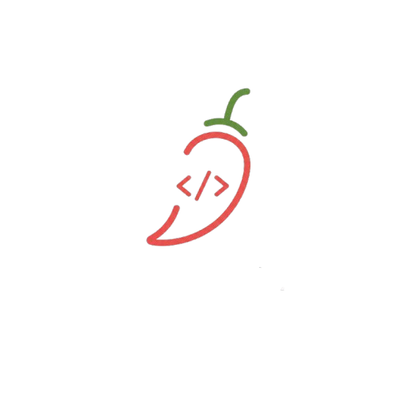
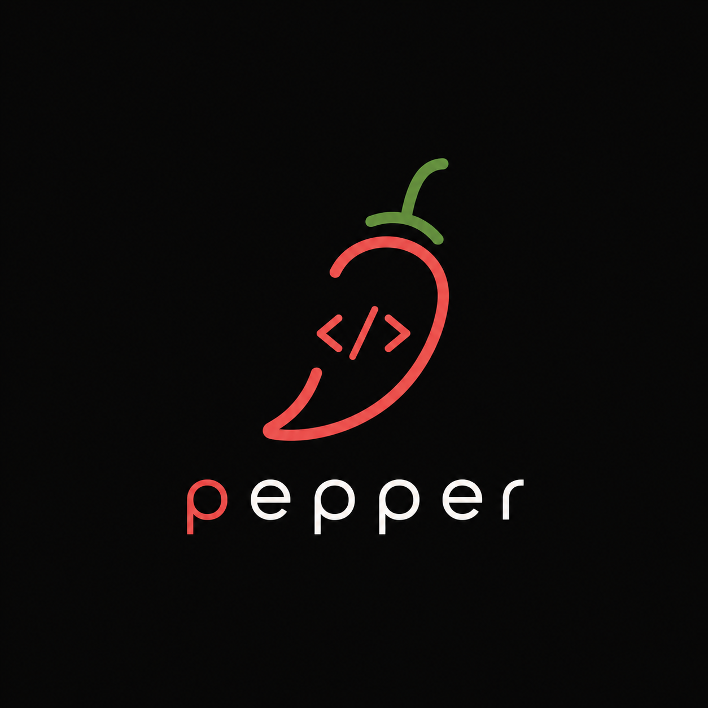

<p align="center">
  
</p>


# Pepper, Linguagem de Programação


Bem-vindo ao projeto Pepper: uma linguagem de programação educacional e experimental desenvolvida neste repositório. Este documento descreve o propósito, arquitetura, instalação, exemplos de uso, sintaxe, ferramentas e como contribuir.


**Status:** Experimental — implementações de *lexer*, *parser*, *AST*, e um *compiler/interpreter* simples estão incluídas.

**Índice**

- [Visão Geral](#visão-geral)
- [Características](#características)
- [Arquitetura do Projeto](#arquitetura-do-projeto)
- [Instalação e execução](#instalação-e-execução)
- [Sintaxe e exemplos](#sintaxe-e-exemplos)
- [Ferramentas e testes](#ferramentas-e-testes)
- [Estrutura do repositório](#estrutura-do-repositório)
- [Contribuição](#contribuição)
- [Licença](#licença)

## Visão Geral

Pepper é uma linguagem simples pensada para aprendizado de compiladores e interpretes. O objetivo é oferecer um conjunto pequeno de recursos, expressões, funções, controle de fluxo e I/O. Permitindo experimentar com tradução para IR e execução.

O repositório contém uma implementação em Python que inclui:

- `Lexer.py` — análise léxica.
- `Parser.py` — análise sintática e construção de árvore sintática abstrata (AST).
- `AST.py` — estrutura e modelos de nós da AST.
- `Compiler.py` — geração de código intermediário / interpretação.
- `Environment.py` — escopo e ambiente de execução.
- `Token.py` — definições de tokens.
- `main.py` — ponto de entrada para executar arquivos Pepper.

## Características

- Sintaxe compacta e legível.
- Funções de primeira classe e chamadas simples.
- Estruturas de controle: `if`, `for`, `while`.
- Suporte básico a variáveis e operadores aritméticos e lógicos.
- Sistema de ambiente para variáveis locais e globais.

## Arquitetura do Projeto

O fluxo básico do compilador/interpreter é:

1. `Lexer.py` tokeniza o código-fonte.
2. `Parser.py` consome tokens e produz uma `AST` (`AST.py`).
3. `Compiler.py` (ou interpretador) percorre a AST e executa/gera IR.
4. `Environment.py` mantém variáveis e escopos durante execução.

Esses módulos se integram para transformar um arquivo `.obs` (ex.: arquivos de teste em `tests/`) em execução.

## Instalação e execução

Requisitos:

- Python 3.10+ (ou 3.8+ se compatível com dependências locais).

Passos:

1. Clone o repositório.

```bash
git clone <repositório>
```

2. (Opcional) Crie e ative um virtualenv:

```bash
python -m venv .venv
.
# Windows
.\.venv\Scripts\activate
# macOS / Linux
source .venv/bin/activate
```

3. Execute scripts e exemplos diretamente com Python:

```bash
python main.py path/para/programa.obs
```

Observação: `main.py` é o ponto de entrada que carrega um arquivo fonte Pepper, passa pelo lexer e parser e invoca o interpretador/compilador.

## Sintaxe e exemplos

Aqui estão os elementos básicos da linguagem Pepper.

### Literais

- Números inteiros: `42`, `0`, `-7`
- Strings: `"Olá, Pepper"`
- Booleanos: `true`, `false`

### Declaração e atribuição

```pepper
let x$int -> 10;
x -> x + 5;
```

`let` declara variáveis locais. A atribuição usa `=`.

### Funções

```pepper
fun soma(a$int, b$int): int {
  return a + b;
}

let r -> soma(2, 3);
```

Funções retornam com `return`. Os parâmetros são passados por valor.

### Controle de Fluxo

if/else:

```pepper
if (x > 0) {
  printf("positivo\n");
} else {
  printf("não-positivo\n");
}
```

while:

```pepper
let i$int -> 0;
while (i < 5) {
  printf("%d\n", i);
  i -> i + 1;
}
```

for (exemplo comum):

```pepper
for (let i$int -> 0; i < 10; i -> i + 1) {
  printf("%d ", i);
}
```

### Exemplo completo

```pepper
fun factorial(n$int) {
  if (n <= 1) {
    return 1;
  }
  return n * factorial(n - 1);
}

let f5$int -> factorial(5);
printf("5! = %d\n", f5);
```

### Entrada/Saída

O repositório inclui uma função `printf` (ou equivalente) para saída formatada.

## Ferramentas e testes

Existe uma pasta `tests/` com arquivos `.obs` que demonstram programas de exemplo e casos de teste. Para executar manualmente um teste:

```bash
python main.py tests/test.obs
```

Há também scripts auxiliares em `scripts/` (por exemplo, `scripts/inspect_tokens.py`) para depuração do lexer.

## Estrutura do repositório

- [AST.py](AST.py) — Definições da AST
- [Compiler.py](Compiler.py) — Geração de IR / interpretador
- [Environment.py](Environment.py) — Gerenciamento de escopos
- [Lexer.py](Lexer.py) — Tokenização
- [Parser.py](Parser.py) — Parsing e construção da AST
- [Token.py](Token.py) — Representação de tokens
- [main.py](main.py) — Entrada para execução de arquivos Pepper
- [scripts/](scripts/) — Ferramentas auxiliares
- [tests/](tests/) — Programas de exemplo e casos de teste
- [img/pepper_logo.png](img/pepper_logo.png) — Logo do projeto
- [img/pepper_logo_wbg.png](img/pepper_logo_wbg.png) — Logo com fundo

## Contribuição

Contribuições são bem-vindas. Sugestões de issues, correções de bugs e melhorias de documentação ajudam muito.

- Abra uma *issue* descrevendo o problema ou feature.
- Para correções: faça um fork, crie uma branch, implemente e submeta um *pull request*.

Guidelines de contribuição:

- Mantenha mudanças pequenas e focadas.
- Adicione testes para novas funcionalidades quando possível.
- Documente a mudança no `README.md` ou crie exemplos em `tests/`.

---

<p align="center">
  
</p>
